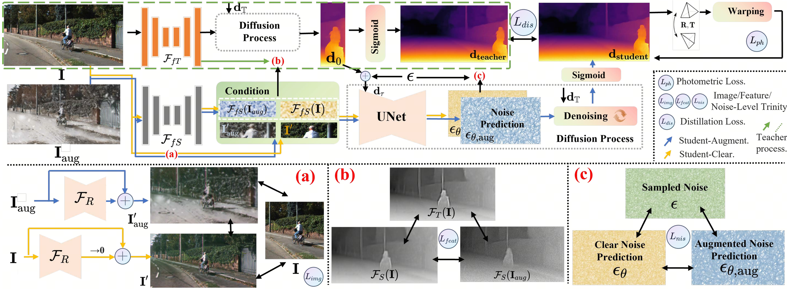

<h2>Digging into Contrastive Learning for Robust Depth Estimation
 with Diffusion Models</h2>
<a href='https://scholar.google.com/citations?user=subRjlcAAAAJ&hl=zh-CN' target='_blank'>Jiyuan Wang</a>1•<a href='https://scholar.google.com/citations?hl=zh-CN&user=t8xkhscAAAAJ' target='_blank'>Chunyu lin</a>1•<a href='https://scholar.google.com/citations?hl=zh-CN&user=vo__egkAAAAJ' target='_blank'>Lang Nie</a>1•<a href='XXX' target='_blank'>Shuwei Shao</a>2

1Beijingjiaotong University 1Beihang University

**ACM MM 2024**

    

## 📢 Upcoming releases & Catalog

- [x] [**release code for training and testing**](#-pretrained-weights-and-evaluation)
- [x] **train/validate data release**(Please refer to [Weatherdepth](https://github.com/wangjiyuan9/WeatherDepth))
- [ ] **finish the ReadMe** 
- [ ] [**test data release**](#-dataset-preparation)(Dense dataset will be available)
- [ ] [**model release**](#-pretrained-weights-and-evaluation) (D4RD, D4RD+ will be avalible)
- [ ] **realease the [introduction video]() for the paper**
